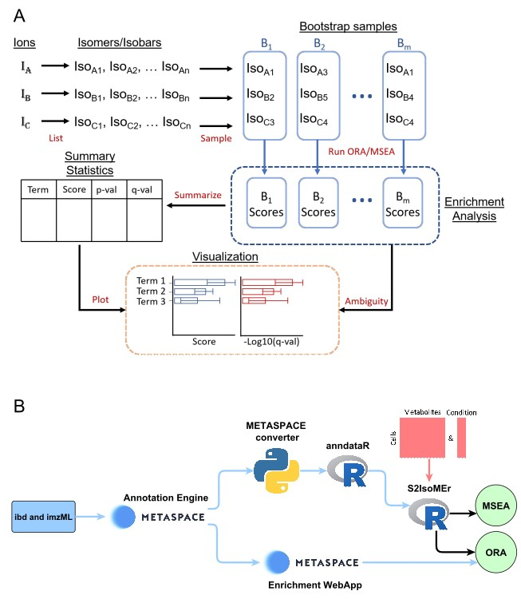

# S2IsoMEr

## Overview

`S2IsoMEr` is an R package for metabolite enrichment analysis in imaging MS. `S2IsoMEr` can be applied to spatial and single-cell metabolomics datasets and addresses the challenge of metabolite identification ambiguity. The key idea to handle molecular isomers and/or isobars is to propagate the molecular ambiguity to the enrichment results as follows: We apply iterative random sampling (bootstrapping), perform enrichment analysis for each iteration, and report summarized results.



## Installation

```         
install.packages("devtools")
devtools::install_github("alexandrovteam/S2IsoMEr")
```

## Features

`S2IsoMEr` supports both overrepresentation analysis (ORA) and metabolite set enrichment analysis (MSEA) for metabolite and lipid-based backgrounds. Metabolite backgrounds are curated from [RAMP-DB 2.0](https://academic.oup.com/bioinformatics/article/39/1/btac726/6827287), encompassing biological pathways and metabolic classes, which are further categorized into super, main, and sub-classes. The pathways from RAMP-DB integrate multiple resources, including SMPDB, Reactome, KEGG, and WikiPathways. For lipids, similar background types are provided, with the addition of the [LION](http://lipidontology.com/) lipid ontology. Except for the LION ontology, each term is mapped to either molecule names or sum formulas, allowing enrichment analysis to be performed with or without consideration of isomeric/isobaric ambiguity.

## Licence

`S2IsoMEr` is licensed under the MIT License. See the [LICENSE](https://github.com/alexandrovteam/S2IsoMEr?tab=MIT-1-ov-file) file for more details.

## Citation

Check out our preprint on bioRxiv: [Enrichment analysis for spatial and single-cell metabolomics accounting for molecular ambiguity](https://www.biorxiv.org/content/10.1101/2024.08.23.609355v1).

